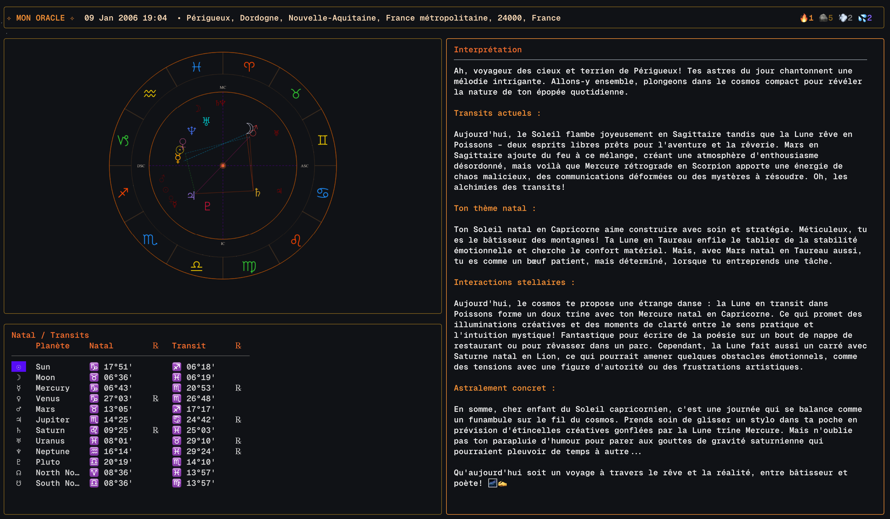

# Horoscope TUI

Parce que la science n'explique pas tout et l'informatique c'est surfait, voici une app pour calculer des thèmes astrologiques dans le terminal et répondre à vos questions.

Calcule la position des planètes avec de jolies équations et génère une jolie roue du zodiaque. Laissez un Oracle vous expliquer pourquoi Mercure rétrograde a encore cassé la prod.



## Installation

```bash
go install github.com/ctrl-vfr/horoscope-tui/cmd@latest
```

## Prérequis

### Terminal compatible

Un terminal supportant le protocole graphique Kitty :
- [Kitty](https://sw.kovidgoyal.net/kitty/)
- [Ghostty](https://ghostty.org/)
- [WezTerm](https://wezfurlong.org/wezterm/)

### resvg

```bash
brew install resvg
# ou
cargo install resvg
```

### Variables d'environnement

```bash
export HOROSCOPE_CITY="Paris, France"
export OPENAI_API_KEY="sk-..."
```

## Mise en garde

Je ne tiens pas responsable des conséquences de l'utilisation de ce programme et de la prise de décision que vous en prendrez en écoutant l'Oracle.
