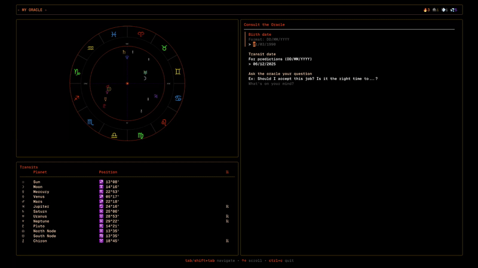

# Astral TUI

[](https://go.dev/)
[](LICENSE)

Because science doesn't explain everything and computers are overrated, here's an app to calculate astrological charts in the terminal and answer your questions.

Calculates planetary positions with beautiful equations and generates a gorgeous zodiac wheel. Let an Oracle explain why Mercury retrograde broke prod again.


## Demo



## Features

- **Pure astronomical calculations** - No external ephemeris, just beautiful math
- **SVG zodiac wheel** - Generated and rendered via Kitty graphics protocol
- **AI-powered Oracle** - GPT-4o interprets your chart with cosmic wisdom
- **Multilingual** - English, French, Spanish, German
- **Modern TUI** - Built with Charm's Bubble Tea

## Installation

```bash
go install github.com/ctrl-vfr/astral-tui@latest
```

## Prerequisites

### Compatible Terminal

A terminal supporting the Kitty graphics protocol:

- [Kitty](https://sw.kovidgoyal.net/kitty/)
- [Ghostty](https://ghostty.org/)
- [WezTerm](https://wezfurlong.org/wezterm/)

### resvg

```bash
brew install resvg
# or
cargo install resvg
```

### Environment Variables

```bash
export ASTRAL_CITY="Paris, France"
export OPENAI_API_KEY="sk-..."
export ASTRAL_OPENAI_MODEL="gpt-4o"  # optional, default: gpt-4o-mini
```

## Localization

The application automatically detects your system locale (`LANG`, `LC_MESSAGES`, or `LC_ALL`) and displays the interface in the corresponding language.

Supported languages:
- English (default)
- French
- Spanish
- German

## How it works

- Planetary positions calculated using Keplerian orbital elements
- House cusps via Placidus system
- SVG rendered to PNG with resvg, displayed via Kitty graphics protocol
- Built with [Bubble Tea](https://github.com/charmbracelet/bubbletea), [Lip Gloss](https://github.com/charmbracelet/lipgloss), and [Huh](https://github.com/charmbracelet/huh)

## Disclaimer

I am not responsible for the consequences of using this program or any decisions you make based on the Oracle's advice.
